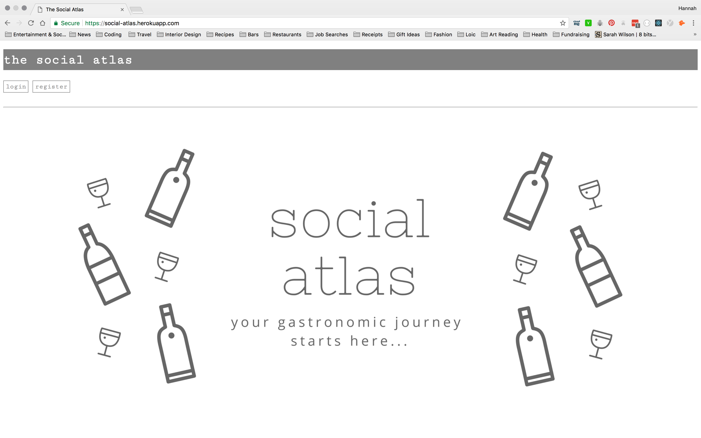
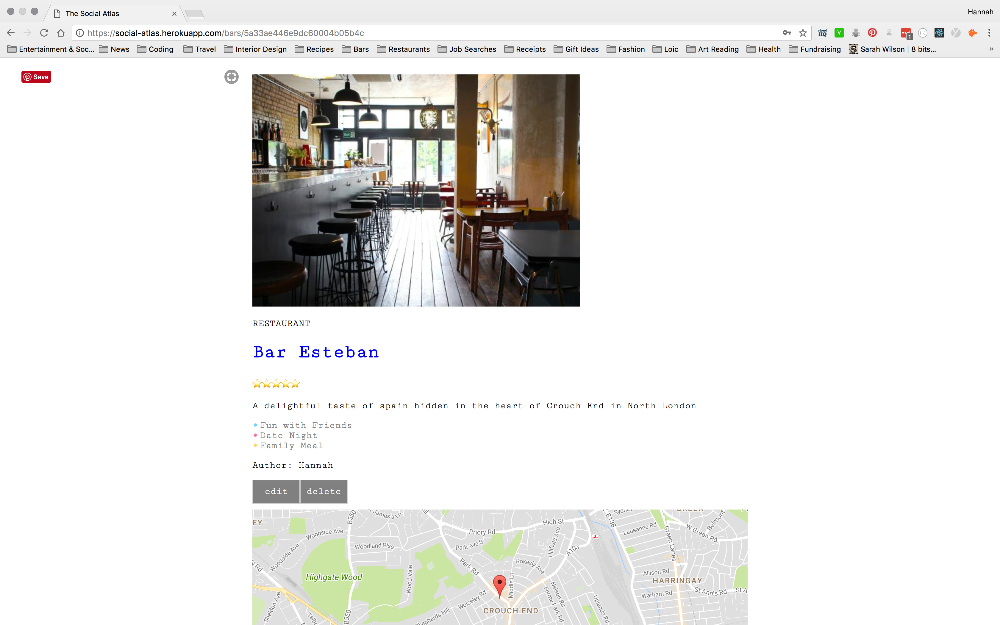
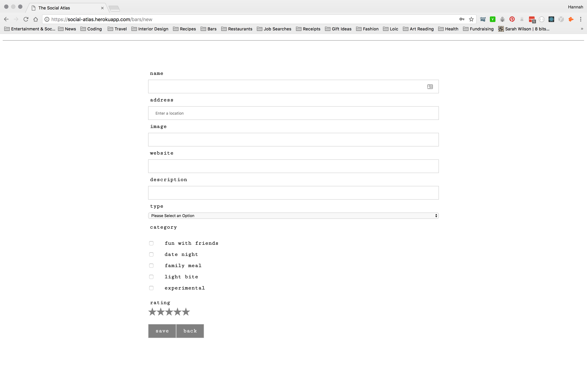
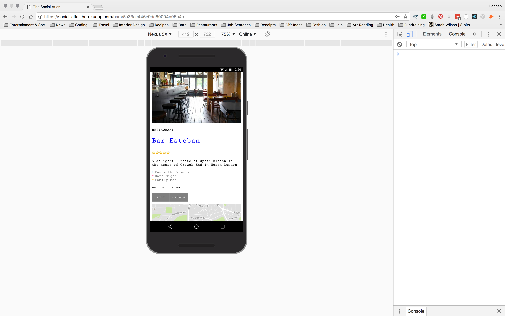
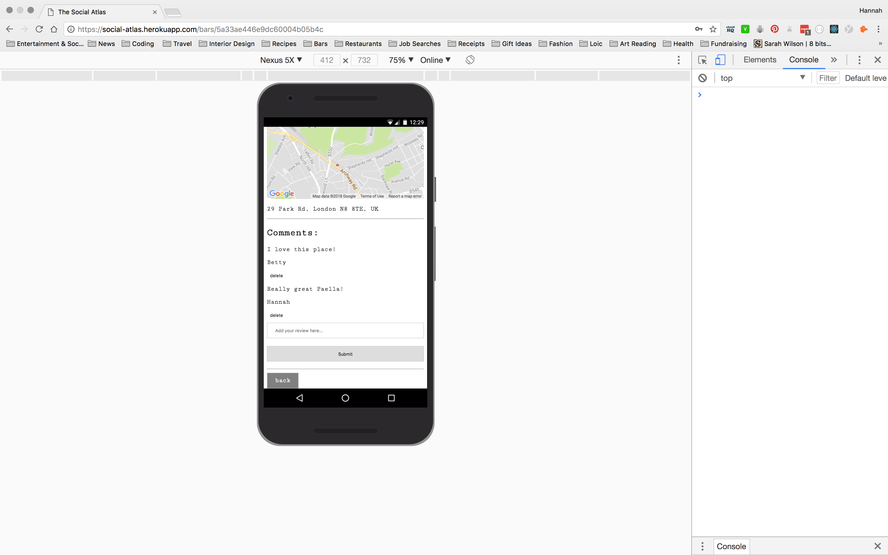
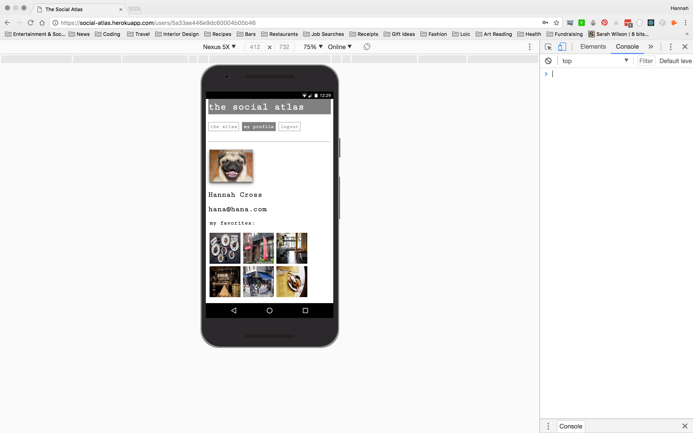

# WDI Project 4: MERN Stack

<h1>Final Project</h1>

<h2>Planning</h2>

1. wireframe
2. planning schema and models
3. setting up routes and controllers for user and resource
4. seeding data
5. testing routes in insomnia
6. testing backend with mocha/chai
7. review schemas with a view to efficient functionality

<h2>The App</h2>
Inspired by websites such as BarChick, The Nudge, TripAdvisor, I set out to create a website where users could post their favourite bars, restaurants, cafes etc and view others' favourites as well. The remit would be global and this way if you are planning a trip somewhere or a friend asks for recommendations you have a ready built resource to share with others.

<h2>Technologies Used:</h2>
<li>Node.js <li>Express<li>React<li>SCSS<li>Yarn & Webpack<li>Mocha & Chai<li>MongoDB & mongoose<li>Google Maps & Places API

<h2>Challenges:</h2>
Learning React was both a joy and a challenge. Particularly understanding concepts such as state and props. Applying this to data from third party APIs, in this case, Google, was also tricky. Breaking down the relationships between components in order to pass props in the best way took some time to figure out. Although this was difficult, the documentation was very helpful and there is a lot of advice and help online which helps to break down some of these concepts. It was also incredibly helpful to be able to talk through problems with tutors and classmates. I feel as if I have a better understanding of JavaScript thanks to my experience with React so far.

<h2>Learning:</h2>
Using React has given me more experience with vanilla JavaScript and enabled me to clearly breakdown how elements ( or components! ) work together. Using Node.js also allowed me to once again practice my back-end development set up using Express.  

 
In order to create some seemingly simple visual effects I was amazed to discover how much programming I needed to implement. In particular I am thinking of the favourites feature I added to my website. When a user "saves a favourite" the heart icon changes from a static shape to a red beating heart. In addition to the  "on click" function I needed to add code to the back end controllers in order to save the favourite to the users array, and allow both the database and DOM to be updated in real time.

<h2>Still to implement:</h2>
I plan to improve the responsiveness of the website. I also plan to set up an average ratings feature and allow users to add ratings to other people's posts. Implementing an OAuth login will also be on my to-do list for this project.

